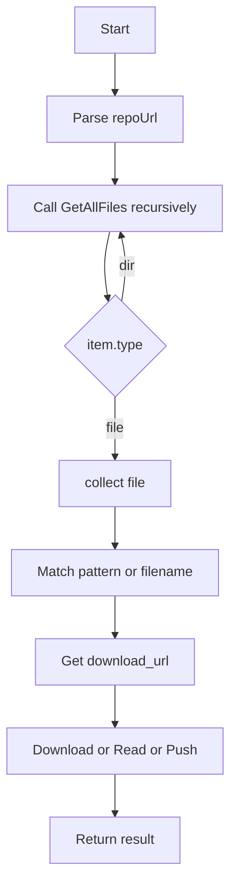

# GitUtility 开发者指南

参考文件: [`Library/Environments/SDK/Drx.Sdk.Shared/Utility/GitUtility.cs`](Library/Environments/SDK/Drx.Sdk.Shared/Utility/GitUtility.cs:1)

概要

GitUtility 提供一组基于 GitHub REST API 的静态帮助方法，用于枚举仓库文件、读取或下载原始文件、以及向仓库推送文件。

Public 类型

- GitHubContent

```csharp
public class GitHubContent
{
    public string name { get; set; }
    public string path { get; set; }
    public string type { get; set; }
    public string download_url { get; set; }
    public string sha { get; set; }
}
```

公共方法概览

- Task<List<GitHubContent>> GetRepoAllFileName(string repoUrl, string branch = "main", string? personalAccessToken = null)
- Task<string> GetRawFileUrl(string repoUrl, string fileName, string branch = "main", string? personalAccessToken = null)
- Task<bool> DownloadRaw(string repoUrl, string fileName, string savePath, string branch = "main", string? personalAccessToken = null)
- Task<bool> PushFile(string repoUrl, string filePath, string repoPath, string commitMessage, string branch = "main", string? personalAccessToken = null)
- Task<string> ReadFile(string repoUrl, string fileName, string branch = "main", string? personalAccessToken = null)
- Task<List<string>> GetRawFileUrls(string repoUrl, string fileNamePattern, string branch = "main", string? personalAccessToken = null)
- Task<List<string>> ReadFiles(string repoUrl, string fileNamePattern, string branch = "main", string? personalAccessToken = null)
- Task<bool> DownloadRawBatch(string repoUrl, string fileNamePattern, string saveDirectory, string branch = "main", string? personalAccessToken = null)

详细 API 参考

### GetRepoAllFileName

```csharp
public static async Task<List<GitHubContent>> GetRepoAllFileName(string repoUrl, string branch = "main", string? personalAccessToken = null)
```

- 描述: 解析 repoUrl 获取 owner/repo，使用 GitHub contents API 递归枚举仓库分支下所有文件。
- 参数:
  - repoUrl: 仓库 URL，示例 https://github.com/owner/repo
  - branch: 分支名，默认 main
  - personalAccessToken: 可选的 PAT，用于私有仓库或提高速率限制
- 返回: 包含每个文件或目录的 GitHubContent 列表（只返回文件类型为 file 的项）
- 异常:
  - ArgumentException: repoUrl 格式不正确
  - HttpRequestException/HttpResponseException: 请求失败（由 EnsureSuccessStatusCode 抛出）

### GetRawFileUrl

```csharp
public static async Task<string> GetRawFileUrl(string repoUrl, string fileName, string branch = "main", string? personalAccessToken = null)
```

- 描述: 在仓库中查找与 fileName 精确匹配的路径并返回 download_url（Raw URL）。
- fileName 期望为相对于仓库根的路径，例如 path/to/file.txt
- 异常:
  - FileNotFoundException: 未找到匹配文件

### DownloadRaw

```csharp
public static async Task<bool> DownloadRaw(string repoUrl, string fileName, string savePath, string branch = "main", string? personalAccessToken = null)
```

- 描述: 通过 GetRawFileUrl 获取 Raw URL 并下载到本地 savePath。
- 返回: 下载成功返回 true，否则 false（如果 HTTP 非成功状态则返回 false）
- 注意: 未对 savePath 的目录存在性进行检查（调用者应保证或提前创建目录）

### PushFile

```csharp
public static async Task<bool> PushFile(string repoUrl, string filePath, string repoPath, string commitMessage, string branch = "main", string? personalAccessToken = null)
```

- 描述: 将本地文件 filePath 上传到仓库的 repoPath，使用 GitHub PUT contents API 创建或更新文件。
- 参数:
  - filePath: 本地路径
  - repoPath: 仓库内目标路径（相对于仓库根）
  - commitMessage: 提交信息
- 必须提供 personalAccessToken，否则抛出 ArgumentException
- 行为:
  - 读取本地文件并 Base64 编码后作为 content 提交
  - 先 GET 目标路径以获取 sha（如果存在），如果 GET 返回非 404 且非成功，将抛出 InvalidOperationException 并包含响应详情
  - 调用 PUT API 创建或更新文件；成功返回 true，否则读取响应并抛出 InvalidOperationException
- 异常:
  - ArgumentException: repoUrl 无效或未提供 PAT
  - FileNotFoundException: 本地文件不存在
  - InvalidOperationException: HTTP 请求返回错误并提供响应信息

### ReadFile

```csharp
public static async Task<string> ReadFile(string repoUrl, string fileName, string branch = "main", string? personalAccessToken = null)
```

- 描述: 返回远程文件内容字符串；内部通过 GetRawFileUrl 获取 Raw URL 并 GET
- 异常:
  - FileNotFoundException: 无法读取文件或 HTTP 非成功

### GetRawFileUrls / ReadFiles / DownloadRawBatch

- 描述: 支持通配符模式 "*.ext"（仅前缀为 *., 基于文件扩展名匹配）；否则按完整路径匹配单个文件。
- GetRawFileUrls 返回匹配文件的 download_url 列表
- ReadFiles 返回每个匹配文件的文本内容列表（若单个文件 HTTP 获取失败，当前位置为 null）
- DownloadRawBatch 将匹配文件下载到 saveDirectory，返回所有文件均成功时为 true

设计与实现说明

- 使用的 API: GitHub Contents API: https://api.github.com/repos/{owner}/{repo}/contents/{path}?ref={branch}
- 递归枚举: GetRepoAllFileName 调用私有方法 GetAllFiles，遇到目录时递归调用以收集所有 file 类型条目
- HttpClient: 每个外部调用使用 using var client = new HttpClient(); 并设置 User-Agent 为 DRX.Environment/1.0；当提供 personalAccessToken 时在 Authorization header 中设置 token
- JSON 反序列化: 使用 System.Text.Json 反序列化为 GitHubContent 或 List<GitHubContent>
- 身份认证: 通过传入 personalAccessToken（PAT）设置 Authorization header。此类不管理 token 的获取或刷新

错误处理与边界条件

- URL 解析:
  - 代码假设 repoUrl 格式为 https://github.com/owner/repo。对于其它格式（例如带 .git 后缀、含子路径、或企业 GitHub 域）可能解析失败或需调整
- HTTP 错误:
  - GetAllFiles 使用 EnsureSuccessStatusCode，会在非成功响应时抛出 HttpRequestException
  - PushFile 在 GET 阶段若返回非 404 且非成功，会抛出 InvalidOperationException，PUT 不成功时也会抛出 InvalidOperationException 并包含响应体
- 速率限制:
  - 未处理 X-RateLimit-* 或 403 rate limit 情况。对公共 API 大量请求（例如递归大量目录）可能触发限流
- 私有仓库与权限:
  - 读取私有仓库或推送需要 PAT 并确保 PAT 具备相应权限（repo:contents 等）
- 文件名与匹配:
  - 通配符仅支持 "*.ext" 形式，基于字符串 endsWith 进行匹配，大小写敏感取决于 API 返回的 path 大小写
- 文件大小:
  - 对于非常大的文件，API 可能返回不同的响应或要求使用 Git Data API；该实现将全部内容读入内存，可能导致内存高峰
- 并发与性能:
  - 代码未实现并发请求（ReadFiles/DownloadRawBatch 为顺序循环），在大量文件时会耗时较长

线程安全与性能建议

- HttpClient 建议复用:
  - 频繁创建 HttpClient 可能导致 socket 耗尽，应考虑注入共享 HttpClient 或静态单例以复用连接池
- 并发下载:
  - 对 ReadFiles/DownloadRawBatch 可使用并行策略（例如 SemaphoreSlim 限制并发数量）以提高吞吐量并避免速率限制
- 限制与重试:
  - 对于网络错误或 5xx 响应建议实现指数回退重试与速率限制处理（查看响应头 X-RateLimit-Reset）
- 内存:
  - 对大文件使用流式处理避免一次性加载全部字节；对于 PushFile，GitHub Contents API 要求 Base64，因此需注意内存消耗

使用示例

单文件下载:

```csharp
using var ok = await Drx.Sdk.Shared.Utility.GitUtility.DownloadRaw("https://github.com/owner/repo", "path/to/file.txt", "C:/tmp/file.txt", "main", personalAccessToken: null);
```

读取文件内容:

```csharp
var content = await Drx.Sdk.Shared.Utility.GitUtility.ReadFile("https://github.com/owner/repo", "path/to/file.txt", "main");
Console.WriteLine(content);
```

批量下载（按扩展名）:

```csharp
var ok = await Drx.Sdk.Shared.Utility.GitUtility.DownloadRawBatch("https://github.com/owner/repo", "*.ini", "C:/tmp/configs");
```

推送文件到仓库:

```csharp
var success = await Drx.Sdk.Shared.Utility.GitUtility.PushFile("https://github.com/owner/repo", "C:/local/file.txt", "folder/file.txt", "Add file", "main", personalAccessToken: "ghp_xxx");
```

单元测试策略与示例

- 目标: 对网络交互进行隔离，主要 Mock HttpClient 或 HttpMessageHandler，并验证序列化、请求 URL、HTTP 方法与请求体
- 推荐库: Moq / RichardSzalay.MockHttp（更易用的 HttpClient mock）

示例: 使用 RichardSzalay.MockHttp

```csharp
using RichardSzalay.MockHttp;
var mockHttp = new MockHttpMessageHandler();
mockHttp.When("https://api.github.com/repos/owner/repo/contents/*")
        .Respond("application/json", "[{\"name\":\"file.txt\",\"path\":\"file.txt\",\"type\":\"file\",\"download_url\":\"https://raw...\",\"sha\":\"sha1\"}]");
var client = mockHttp.ToHttpClient();
client.DefaultRequestHeaders.UserAgent.ParseAdd("DRX.Environment/1.0");

// 调用内部私有方法需要封装或将 HttpClient 注入以便测试；建议对 GitUtility 做小幅重构以支持注入
```

测试用例清单

- GetRepoAllFileName 成功枚举目录与嵌套目录
- GetRawFileUrl 找到文件与未找到文件（抛 FileNotFoundException）
- DownloadRaw 成功与失败（HTTP 404）
- PushFile 创建新文件、更新已有文件（包含 sha）、GET 返回非 404 错误情况
- ReadFiles 模式匹配正确与错误处理（HTTP 非 200）

Mermaid 调用流程图



实施建议与待办

- 将 HttpClient 注入或使用单例以避免频繁创建
- 为高性能场景实现并发下载和重试策略
- 扩展通配符支持（如 glob）并支持企业 GitHub 域与 .git 后缀处理
- 将 GetAllFiles 对大仓库改为分页或 GraphQL 查询以减少请求次数

文档保存

已生成文档路径: [`Library/Environments/SDK/Drx.Sdk.Shared/Utility/GitUtility.md`](Library/Environments/SDK/Drx.Sdk.Shared/Utility/GitUtility.md:1)

变更记录

- v1.0 初始开发者指南，覆盖 API 参考、设计说明与测试建议